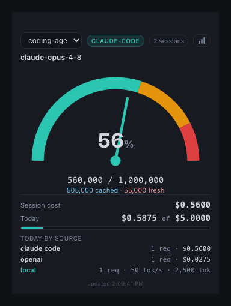
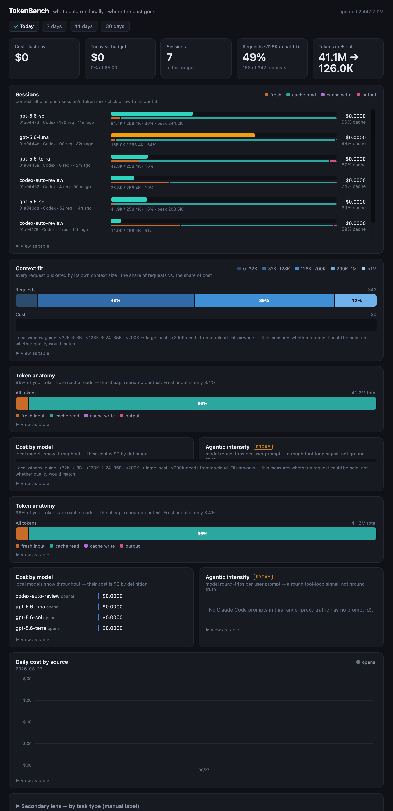

<div align="center">

# TokenBench

**See live token and context usage for each AI CLI session while you build.**

A private macOS widget for Claude Code, Codex, and Pi. TokenBench detects active CLIs, keeps their sessions separate, and lets you choose which session drives the gauge.

[](LICENSE)  -black) 



</div>

---

## What you get

- **One gauge per session.** Choose a Claude Code, Codex, or Pi session instead of mixing every terminal into one total.
- **Live CLI detection.** Chips appear only for supported tools that are actually running.
- **Context and token anatomy.** See context level, fresh input, cache reads, cache writes, and output.
- **Local history.** Session usage stays in a local SQLite database; TokenBench has no analytics service.
- **A real desktop utility.** Window position and the optional **Float on Top** setting persist across launches.

TokenBench reads usage metadata, not terminal text. Codex and Pi prompts and responses are never copied into the database.

## See the session, not just a daily total



When several agents are open, a single total is hard to act on. TokenBench keeps each CLI session separate, shows the project and model attached to it, and switches the gauge immediately when you choose another session.

The dashboard remains available for daily totals, token composition, models, and request history.

## Use TokenBench

### Install the Mac app

For Apple Silicon, download the prebuilt `.dmg` from [Releases](https://github.com/sumin6475/token-bench/releases/latest), or build it locally:

```bash
# one-time: Rust toolchain + bundled Node binary (~114 MB, excluded from git)
curl --proto '=https' --tlsv1.2 -sSf https://sh.rustup.rs | sh
cp "$(command -v node)" desktop/src-tauri/binaries/node-aarch64-apple-darwin

cd desktop && npm install && npm run build

# launch the local build immediately
open src-tauri/target/release/bundle/macos/TokenBench.app
```

On an Intel Mac, name the binary `node-x86_64-apple-darwin`. See [`desktop/README.md`](desktop/README.md) for details.

Open TokenBench before starting work. The app starts its collector automatically.

### Use it day to day

1. Open TokenBench from Applications.
2. Start Codex, Pi, or Claude Code in your terminal.
3. Click the session selector at the top of the widget.
4. Choose the project/session whose context gauge you want to watch.
5. Use **Window → Float on Top** when you want the widget pinned above other windows.

Codex and Pi work without a wrapper. Claude Code must send its native OTLP telemetry to TokenBench:

```bash
# From a cloned TokenBench repository
./tb-claude
./tb-claude --continue
```

If you installed only the DMG, add these variables to the shell that launches `claude`:

```bash
export CLAUDE_CODE_ENABLE_TELEMETRY=1
export OTEL_EXPORTER_OTLP_PROTOCOL=http/json
export OTEL_EXPORTER_OTLP_ENDPOINT=http://127.0.0.1:4318
export OTEL_LOGS_EXPORTER=otlp
export OTEL_METRICS_EXPORTER=otlp
export OTEL_LOGS_EXPORT_INTERVAL=1000
export OTEL_METRIC_EXPORT_INTERVAL=1000
```

Then restart Claude Code normally. When working from the repository, `node collector.js --check` diagnoses the connection if no usage arrives.

### Supported CLIs

| Tool | Setup | Usage source | Cost |
| :--- | :--- | :--- | :--- |
| Codex | None | Usage-only events in `~/.codex/sessions` | Subscription usage; API dollar cost unavailable |
| Pi | None | Assistant usage metadata in `~/.pi/agent/sessions` | Shown when Pi reports it |
| Claude Code | `tb-claude` or the OTLP variables above | Native OpenTelemetry | Reported API cost |

### Run the core without the app

Requires Node 22+; the core uses the built-in `node:sqlite` and has no package install step.

```bash
git clone https://github.com/sumin6475/token-bench.git
cd token-bench
node collector.js --db tokenbench.db --tokens --proxy
```

Open **http://localhost:4318/widget** for the gauge or **http://localhost:4318/dashboard** for the dashboard. Read terminal totals with `node stats.js --db tokenbench.db`.

### Optional API proxy

Point a compatible tool's base URL at one of the following local routes. The proxy forwards the request to the selected provider and records the returned usage locally.

| Configure this base URL | Destination | Reported as |
| :--- | :--- | :--- |
| `localhost:8787/openai/v1` | OpenAI | OpenAI API usage |
| `localhost:8787/anthropic/v1` | Anthropic | Anthropic API usage |

Only clients that honor `OPENAI_BASE_URL` or `ANTHROPIC_BASE_URL` can be captured this way. The `x-tb-upstream` header refuses private and loopback destinations unless the collector is explicitly started with `--allow-private-upstream`.

## How it works

```
Claude Code ──OTLP/HTTP────────┐
Codex ────────usage JSONL──────┼──► collector ──► SQLite ──► session picker + gauge
Pi ───────────usage JSONL──────┤
API clients ──optional proxy───┘
```

- **Claude Code** emits native OpenTelemetry after its environment is pointed at the collector.
- **Codex and Pi** are tailed incrementally; only session, model, project, token, context-window, and cost metadata is persisted.
- **The proxy** forwards OpenAI- or Anthropic-compatible traffic unchanged, streams the upstream response back, and reads its `usage` object.
- **The UI** is either a compact Tauri window (with a persistent Window → Float on Top toggle) or the same zero-dependency Node core in a browser.

### The pipe is a measured thing, not a given

A collector that receives nothing looks identical to "Claude did nothing" unless it says otherwise. Three guards ship with it:

- **`/healthz` `/readyz` `/tracking-status`** — the collector's own wire-level liveness: what arrived, when, and whether any `api_request` ever came in. `tracking-status` reports `starting / not_configured / partial / healthy / idle / stale` with a reason.
- **Console warnings** — after `--stale-after` minutes (default 15) without telemetry the collector warns that Claude may be idle *or* untracked; it never claims "nothing happened".
- **`node collector.js --check`** (or `tokenbench doctor`) — a pipe checklist: port reachable, OTLP env vars set, claude on PATH, and an end-to-end probe POST through `/v1/logs`.
- **The widget shows a pipe pill** next to the model name (`live` / `idle` / `not configured` / `events, no api requests`), with the reason on hover.

### Usage that can't be extracted is counted, not dropped

A proxy request that reaches the proxy but returns no `usage` object (streaming without `include_usage`, error bodies, …) is stored with `usage_status = no_usage | empty_response` and `cost_source = unknown`. It counts in the request totals, it just carries no cost guess. The same honesty applies to upstream connection failures (counted as `upstreamErrors`) and to a changed Claude Code wire: every event type seen is recorded in the `event_observations` census (attribute keys only, never values), so a new `query_source` or a dropped event shows up in `stats.js` and `/event-coverage` instead of melting silently.

## Engineering decisions that make the numbers credible

- **Observed wire over assumed spec.** The collector schema, captured in [`schema-observed.md`](schema-observed.md), is the source of truth. Real captures exposed coercion and billing differences that would otherwise silently skew totals.
- **PII allowlist, not blocklist.** Only fields needed for measurement are persisted. A disk-scan test covers both the SQLite database and its WAL, preventing observed identity fields from landing on disk.
- **Integer accounting.** Cost is stored in integer millionths of a dollar, avoiding accumulated floating-point drift.
- **Measured scope, stated limits.** Context size is directly observable per request; agentic intensity is explicitly presented as a Claude-Code-only proxy. Unmeasurable reasoning difficulty is not invented as a metric.
- **Captured-data tests.** 79 tests cover CLI discovery, session parsing, privacy, compaction, pricing, proxy routing, reconciliation, and token anatomy.

The analytics store stays local. When you opt into a cloud API route, the proxy sends that request only to the provider you selected; TokenBench does not send usage analytics to its own service.

## Where it fits

- **[ccusage](https://github.com/ryoppippi/ccusage) and similar tools** are excellent time-based Claude Code reports. TokenBench is a live desktop gauge with selectable sessions across several CLIs.
- **Helicone, Langfuse, Portkey, and OpenMeter** provide team-scale API observability. TokenBench is a local personal view for terminal-based coding sessions.

## Publishing on GitHub

Recommended repository description:

> Local macOS widget for live, per-session token and context usage across Claude Code, Codex, and Pi.

Recommended topics: `ai-cli`, `token-usage`, `claude-code`, `codex`, `pi`, `macos`, `tauri`, `developer-tools`.

Every GitHub Release should state these points clearly:

- The download is a **Developer ID-signed and notarized DMG**, not a Mac App Store build.
- TokenBench is not sandboxed because it detects local CLI processes and reads usage metadata from `~/.codex/sessions` and `~/.pi/agent/sessions`.
- It stores usage metadata locally and does **not** ingest Codex/Pi prompt or response content.
- Claude Code requires OTLP configuration or `tb-claude`; Codex and Pi require no wrapper.
- The current binary is Apple Silicon-first.

Suggested release note introduction:

> TokenBench is a local macOS session gauge for AI CLI work. Open the app, use Codex or Pi normally, or launch Claude Code with TokenBench OTLP enabled, then select a session to watch its live context and token usage. All analytics stay on your Mac.

Prepare a versioned release with:

```bash
cd desktop
./build.sh --release 0.3.0
git tag v0.3.0
git push origin main v0.3.0
gh release create v0.3.0 \
  src-tauri/target/release/bundle/dmg/TokenBench.dmg \
  --generate-notes
```

Do not publish the unsigned development DMG as a public release.

## Limits

- **Agentic intensity is a proxy.** It infers tool-loop depth from Claude Code's `prompt.id` reuse and is unavailable for generic proxy traffic.
- **Capture is adapter-based, not packet sniffing.** Claude Code uses OTLP, Codex/Pi use their local usage metadata, and compatible API clients use the proxy. Other tools bypassing all three paths are not measured; `tokenbench run -- <cmd>` only captures tools that honor `OPENAI_BASE_URL` / `ANTHROPIC_BASE_URL`.
- **The app is Apple-Silicon-first.** Bundling Node removes setup for app users at the cost of roughly 114 MB.
- **Distribution is a notarized DMG, not the Mac App Store.** App Sandbox blocks the process discovery and home-directory session adapters that make the multi-CLI widget useful. Release versions can be prepared with `cd desktop && ./build.sh --release <semver>` and uploaded to GitHub Releases.

For the measurement redesign and its discarded manual task-type axis, see [`docs/journal/`](docs/journal/). The original architecture is in the [PRD](token-bench-prd-v1.1.md).

## Project layout

| Path | Purpose |
| :--- | :--- |
| `collector.js` | OTLP receiver, in-process proxy, health endpoints, `--check`, and schema summary |
| `src/store.js` · `src/cli-session-scanner.js` | allowlist, accumulation, CLI process discovery, and Codex/Pi usage-only log adapters |
| `src/proxy-core.js` · `src/pricing.js` | proxy forwarding, Gemini/OpenAI/Anthropic usage extraction, SSRF guard, pricing |
| `bin/tokenbench` · `tb-claude` | launcher CLI: guaranteed-telemetry `claude`, proxy-env `run`, `status`, `doctor` |
| `widget.html` · `dashboard.html` | always-on gauge (with pipe pill) and request-aware dashboard |
| `stats.js` | read-only terminal report; checks totals against `/cost`; wire census |
| `desktop/` | Tauri v2 Mac app with a bundled sidecar |
| `docs/journal/` | development hypotheses and measurement decisions |

## License

[MIT](LICENSE) © 2026 Sumin
